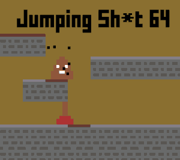

# 👋 Hi, I’m @Pavel40

Alright, let me introduce myself - my name is Pavel, and I’m a programmer and web designer (or at least I think I am).

My email 📬 : <pav40@protonmail.com>  
My personal website: [pavel40.github.io](https://www.pavel40.github.io)

## About me

I am a programmer, web designer, and 🎮 game developer. Or at least I'm doing my best to be one. I like to explore new things, practice coding and play computer games.

If, for whatever reason, you want to know what is my favorite computer game and what is my favorite 📖 book, I can tell you I really like The Witcher books and games.

### Favorite technologies
+ **Python 3** - my favorite programming language
+ **Tailwind CSS** - my favorite CSS framework
+ **Godot engine** - my favorite game engine

## Programming

My favorite programming language is **Python 3**. I have some basic knowledge of the Flask microframework, which I can use as backend of web applications. Another option for backend of web apps is **PHP**, of which I know some basics too (but I don't like PHP). I can also create scripts for my websites in vanilla **JavaScript** ES6. I also know a tiny bit of C (and a bit of C++, I'm interested in Arduino, and Internet of Things).

## Web design

I can design and create great looking websites using modern technologies - HTML 5, CSS 3, and JavaScript ES6. I can also use Bootstrap and Bulma framework to build websites really fast. I make responsive websites (the site fits every screen) and I can also enable dark mode.

I am also able to convert PSD (PhotoShop) or XCF (GIMP) files to responsive HTML templates.

## Game developement

I’m also trying to get into game developement. I’m not very experienced, really just a beginner. I’m learning to use Godot Engine, because it’s free and open-source.

If you don’t have anything to do, feel free to check my attempts on games on my itch.io. They’re all free, of course.
